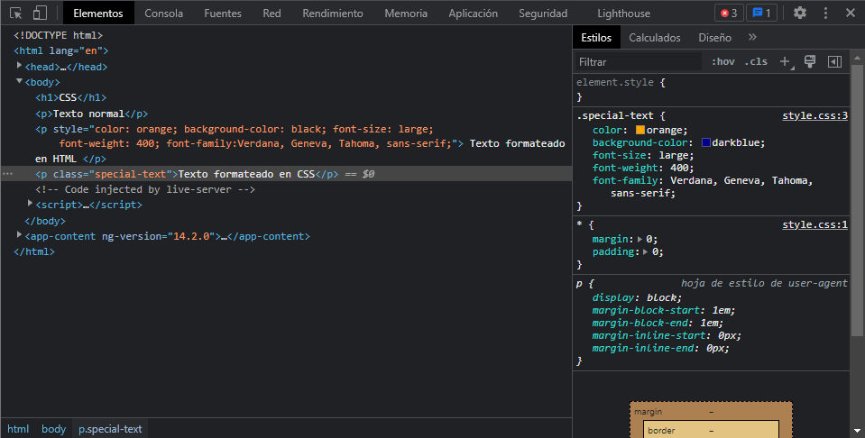
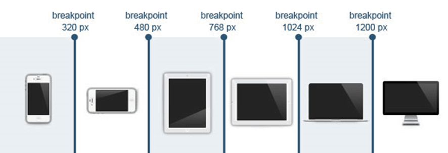

# ¿Cómo empezar con CSS?

(Introducción to guapa que ya pensaré en otro momento)

Una de las mejores herramientas para ir comprobando poco a poco los distintos cambios es presionar F12 estando en el navegador, e ir cambiando las distintas clases ahí. Una vez se está conforme con el resultado copiar los cambios al código.



Puede que se vea mejor mirando el HTML/CSS directamente: [CSS.html](./examples/css.html).

Algunos errores básicos al empezar pueden ser:

No darse cuenta que es en cascada, esto significa que a medida que se escriben nuevos atributos, se pueden ir sobreescribiendo los atributos anteriores.

Ejemplo Final

## Información básica

[Página de referencia](https://www.diegocmartin.com/como-empezar-con-css/).

Se puede estilizar las distintas etiquetas de forma directa desde la etiqueta usando el atributo *style:*

`<p style="color:'orange'; background-color: 'whitesmoke'">Hola</p>`

Aunque lo preferible es separar ambos ficheros, y dejar TODO el estilo en los CSS y toda la estructura en el HTML.

```apache
# Ubicado en style.css
.special-text{ 
    color: orange;
}

# Ubicado en index.html
<p class="special-text">Texto especial</p>
```

## Relacionadas con texto

```apache
# Ubicado en style.css
.special-text{ 
    color: orange;
    background-color: black;
    font-size: large;
    font-weight: 400;
    font-family:Verdana, Geneva, Tahoma, sans-serif;
}

# Ubicado en index.html
<p class="special-text">Texto especial</p>
```

color: color de la letra;

background-color: color del fondo;

font-size: tamaño de la letra;

font-weight: grosor de la letra;

font-family: tipografía de la letra;

line-height: distancia entre líneas (lo normal es dejarlo al 100%);

font-style: normal, itálica, oblicua;

text-align: alineado del texto (lo normal suele ser- center, end o justify);

## Bordes y sombras

Lo más básico de cualquier páginas son lo denomidado "tarjetas" o "contenedores".

Generador de bordes: [https://html-css-js.com/css/generator/border-outline/](https://html-css-js.com/css/generator/border-outline/)

Generador de sombras[:]([https://html-css-js.com/css/generator/box-shadow/](https://html-css-js.com/css/generator/border-outline/)) [https://www.cssmatic.com/box-shadow](https://www.cssmatic.com/box-shadow)

## Espaciados

### Márgenes


Los márgenes es el espacio exterior a la divisón. Se puede configurar de la siguiente forma:

margin: 1px 2px 3px 4px;

Siendo 1px- el superior; 2px el derecho; 3px el  inferior y 4px el izquierdo.

De la misma forma, se puede modificar 1 solo lado del margen haciendo uso de margin-top, margin-right, margin-bottom y margin-left.

### Padding

Los padding es el espacio interior, entre el borde y el contenido. Se puede configurar de la siguiente forma:

padding: 1px 2px 3px 4px;

Siendo 1px- el superior; 2px el derecho; 3px el  inferior y 4px el izquierdo.

De la misma forma, se puede modificar 1 solo lado del padding haciendo uso de padding-top, padding-right, padding-bottom y padding-left.

## Grid y Flex

Página para probar Grid: Grid Garden: [https://cssgridgarden.com/#es]([https://cssgridgarden.com/#es]()).

Página para probar Flex: Flexbox Froggy: [https://flexboxfroggy.com/#es](https://flexboxfroggy.com/#es).

### Grid

[Página de referencia](https://platzi.com/tutoriales/1229-css-grid-layout/6653-todo-lo-que-necesitas-saber-de-css-grid/?utm_source=google&utm_medium=cpc&utm_campaign=19643931773&utm_adgroup=&utm_content=&gclid=EAIaIQobChMIrrKj-Pn-_AIVUASLCh1PZABAEAAYASAAEgI6pvD_BwE&gclsrc=aw.ds).

Se suele usar para mostrar "mosaicos" y tener un control de los distintos elementos dentro de él.

Las órdenes básicas para usar grid son:

display: grid; Para generar un grid.

grid-template-colums: Para definir el nº y ancho de la columna. En orden de izquierda a derecha. Pe. grid-template-colums: 50px 300px;

grid-template-rows: Para definir el nº y alto de la columna, En orden de arriba a abajo. Pe. grid-template-rows: 200px 75px;

### Flex

[Página de referencia](https://developer.mozilla.org/es/docs/Web/CSS/CSS_Flexible_Box_Layout/Basic_Concepts_of_Flexbox).

Se suele usar listar elementos tanto en horizontal como en vertical.

Las órdenes básicas para usar flex son:

display: flex; Para obtener un flex;

flex-direction: en fila, en columna, en fila invertida o en columna invertida.

flex-wrap: en caso de llegar al final de la línea, si se genera un oveflow(nowrap) o si pasa a la siguiente línea (wrap).

Cada elemento interno del flex se puede controlar haciendo uso de `order: n`.

```apache
.verde{ order: 1; }
.rojo{ order: 2; } 
.azul{ order: 1; } 
.morado{ order: 3; }
.rosa{ order: 4; }
.gris{ order: 1; }
```

De esta forma, las cajas se ordenarán tal que verde, azul, gris, rojo, modaro, rosa. Da igual en qué orden coloquemos las distintas cajas en el HTML.


### Distancias

Para hacer las separaciones de los distintos componentes internos se usa **gap**.

## Pseudoclases

[Página de referencia](https://developer.mozilla.org/es/docs/Web/CSS/Pseudo-classes)

Las pseudoclases más usadas son:

`:active` - (Asumamos un botón) Será la apariencia que tenga cuando esté clicado.

`:hover` - Representa la apariencia que tiene  un elemento cuando se pasa el ratón por encima.

`:checked` - Representa la apariencia de los radio-buttons, checkbox y selects al ser seleccionados.

`:disabled` - Representa la apariencia que tiene un elemento desabilitado.

`:valid` - Selecciona cualquier elemento válido.

`:focus` - Representa la apariencia que tiene un elemento cuando está seleccionado. Se suele usar para los inputs.

`:first-child` - El primer elemento dentro de las etiquetas.

`:last-child` - El último elemento dentro de las etiquetas.

`:not()` - Cualquier elemento que no sea lo que está dentro de la función dentro de las etiquetas.

`:nth-child(xn)` - Selecciona cada xn elementos dentro de las etiquetas

`:required` - Selecciona cualquier elemento requerido.

`:visited` - Representa la apariencia que tiene  un elemento cuando se ha visitado. Se suele usar para los enlaces.

**Parada para ver ejemplo de CSS con el formulario de la sección de HTML.**

[CSS](./examples/css-form.html)[.html](./examples/css-form.html)

## Media Querys

[Página de referencia](https://developer.mozilla.org/es/docs/Web/CSS/Media_Queries/Using_media_queries)



En la estética de las distintas páginas es necesario generar distintos formatos en fun.ción del ancho de la página.

Esto se hace con los `@media (max-width: 320px){}` de esta forma, solo cambiarán los elementos que se encuentren dentro del @ media.

Otras de las medias que se pueden utilizar son `@media (orientation: landscape){}` para definir si queremos que los cambios se hagan cuando la orientación de la pantalla es en horizontal o en vertical.

PE.

```apache
# El elemento que tenga .rojo, tendrá color rojo.
.rojo{ color: red }

# Si el ancho es menor de 768px el color del elemento que tenga la clase rojo, será azul.
@media (max-width: 768px){
	.rojo{ color: blue; }
}
```

@media (max-width: 768px){} - Menor o igual a 768px.

@media (max-width: 768px){} - Mayor o igual a 768px

Sigue siendo Estilos en Cascada, por lo que lo que si escribimos:

```apache
.red{ 
	background-color: black; 
	color: yellow;
}


# Menor o igual a 768px.
@media (max-width: 768px){
	.rojo{ color:red; } 
}

# Mayor o igual a 768px
@media (min-width: 768px){
	.rojo{ color:blue; } 
}
```

En ambos casos el fondo será negro, y sólo cambiará el color de la letra. Y en nigún caso el color de la letra será amarillo, ya que se superponen los 2 media queries.

Lo normal sería tener algo como:

```apache
#Cosas por defecto(pantalla mayor a 1200px)

# Entre 1200px y 1024px (formato pantalla normal)).
@media (max-width: 1200px) and (min-width: 1024px)){ }

# Entre 1024px y 768px (formato tablet)).
@media (max-width: 1024px) and (min-width: 768px)){ }

# Entre 768px y 480px (formato movil/orientación horizontal)).
@media (max-width: 768px) and (min-width: 480px)){ }

# Entre 480px y 320px (formato movil orientación vertical)).
@media (max-width: 480px) and (min-width: 320px)){ }

```

Para utilizar los media querys, la mejor forma es con F12, y usar el icono en la esquina superior izquierda, que tiene un movil y una tablet, con esto podrás cambiar el alto y el ancho de la página a antojo.

(No se ve bien debido a que no se puso todavía un formato correcto para estas dimensiones)


## SCSS Básico
